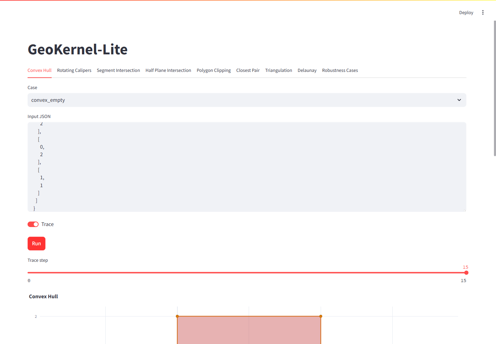
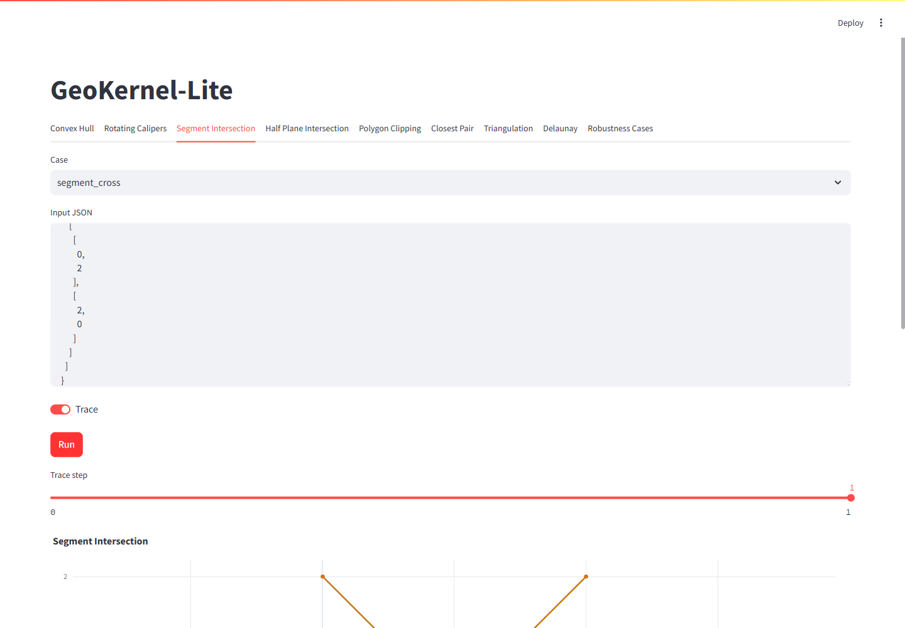
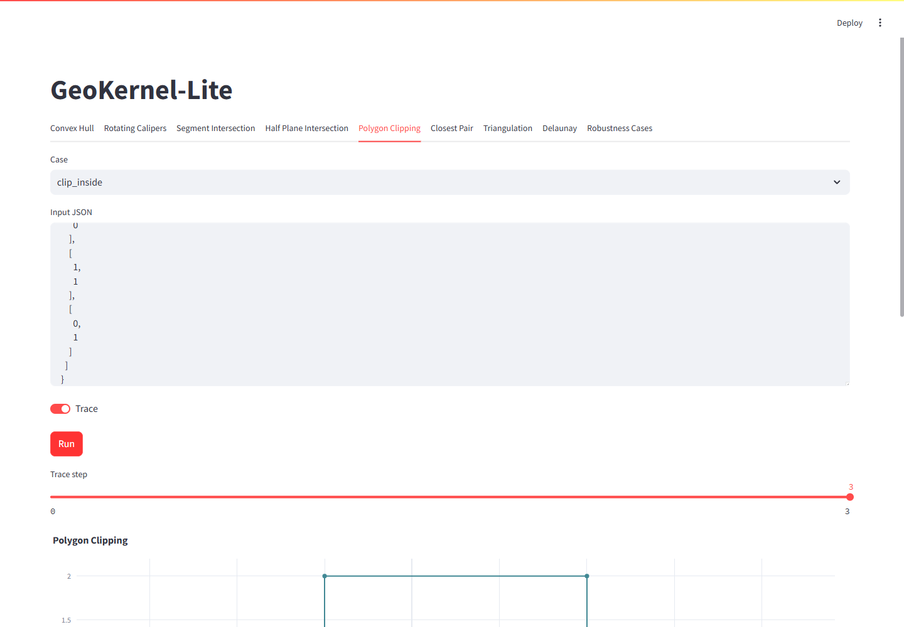
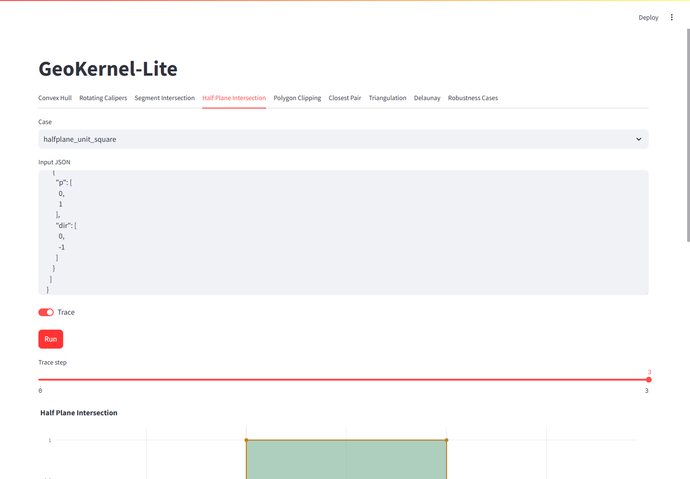
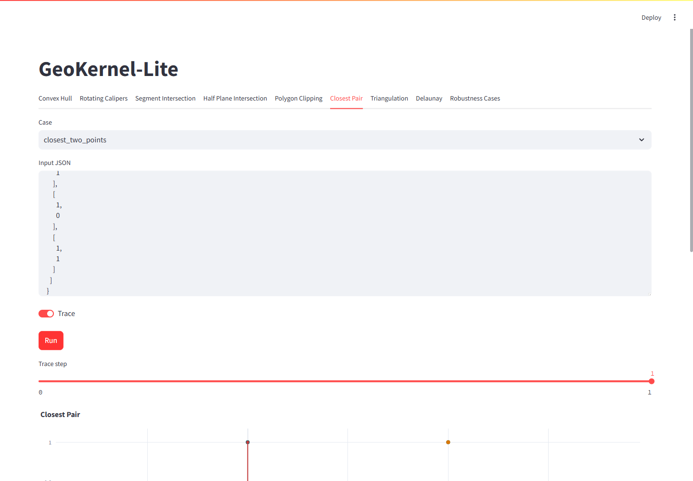
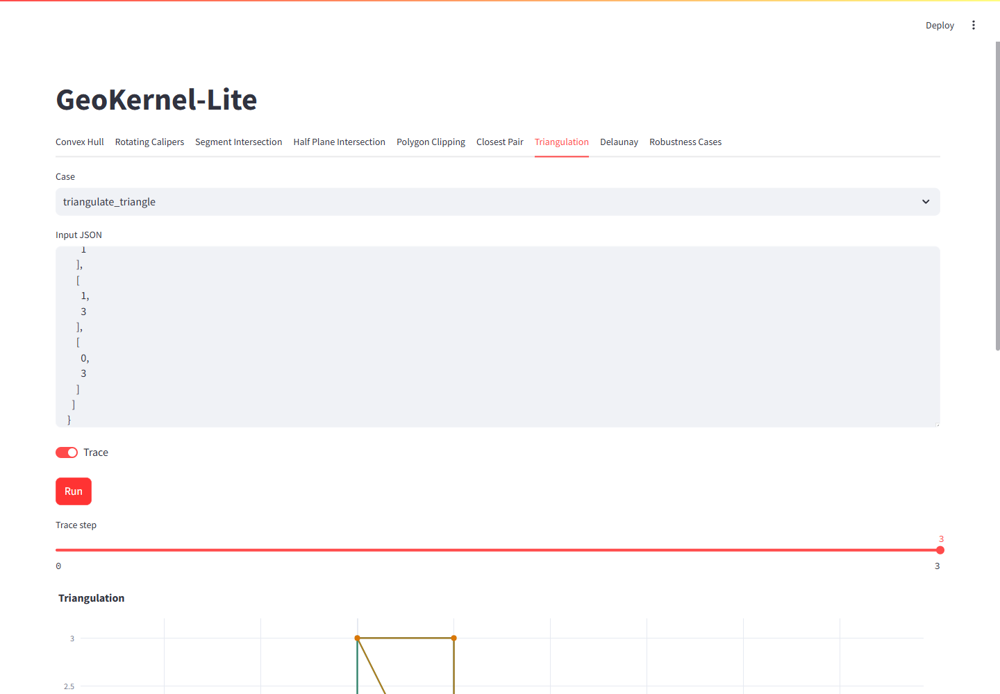

# GeoKernel-Lite: Robust 2D Computational Geometry Playground

[](https://github.com/lazyJLBL/GeoKernel-Lite/actions/workflows/windows.yml)


A lightweight C++17 2D computational geometry playground focused on robust
predicates, degeneracy handling, algorithm tracing, and Streamlit visual debugging.

GeoKernel-Lite 是一个专注于鲁棒谓词、退化案例处理、算法 trace 和可视化调试的
2D 计算几何实验内核。它不是 CGAL/GEOS 的替代品；目标是把计算几何中最容易错
的边界情况展示清楚，并给出可测试、可对比的实现。

## Visual Debugging Screenshots

| Convex Hull                                                           | Segment Intersection                                                                    | Polygon Clipping                                                                |
| --------------------------------------------------------------------- | --------------------------------------------------------------------------------------- | ------------------------------------------------------------------------------- |
|  |  |  |

| Half-Plane Intersection                                                                       | Closest Pair                                                            | Triangulation                                                             |
| --------------------------------------------------------------------------------------------- | ----------------------------------------------------------------------- | ------------------------------------------------------------------------- |
|  |  |  |

## Project Highlights

- C++17 geometry kernel with `Point2D`, `Segment2D`, `Polygon2D`, `HalfPlane2D`, and
  related primitives.
- Predicate comparison API for EPS, filtered exact, and exact `orient2d` / `incircle`
  sign classification over finite `double` inputs.
- Classic geometry algorithms: convex hull, rotating-calipers diameter, segment intersection
  search, half-plane intersection, closest pair, polygon clipping, and ear clipping
  triangulation.
- Sweep-line segment intersection search with ordered active-set neighbor checks,
  exact predicate classification, and a brute-force oracle kept for tests and
  contract-preserving completion.
- Correctness-first segment arrangement builder that splits crossings and overlaps into
  an arrangement-ready graph for future overlay work.
- Experimental Bowyer-Watson Delaunay triangulation with validation reporting for
  visualization and future expansion.
- CLI + JSON boundary between the C++ kernel and Python UI, keeping the algorithm core
  independent from Streamlit.
- 100+ degenerate and boundary cases covering collinearity, overlaps, endpoint touches,
  duplicate points, tiny distances, near-cocircular inputs, orientation issues, empty
  intersections, and degenerate polygon results.

## Features

### Geometry Primitives

- Point, vector, line, segment, circle, polygon, half-plane, box, and triangle types.
- Dot product, cross product, orientation test, distance, projection, and reflection
  helpers.
- Segment intersection with `None`, `Point`, and `Overlap` classification.
- Exact and filtered predicate helpers for orientation and incircle tests.
- Point-in-polygon with `Outside`, `Inside`, and `OnBoundary` classification.
- Polygon area, orientation checks, and counter-clockwise normalization.

### Algorithms

- Andrew convex hull and Graham-compatible entry point.
- O(h) rotating calipers for convex diameter.
- Minimum-area bounding rectangle by edge-direction scan over hull vertices.
- Segment intersection search with classified point and overlap results.
- Half-plane intersection clipped by a configurable visualization bounding box.
- Divide-and-conquer closest pair of points.
- Sutherland-Hodgman polygon clipping.
- Polygon boolean data model, normalization, validation, and CLI skeleton.
- Ear clipping triangulation with area verification.
- Experimental Delaunay triangulation with validation report.
- Predicate comparison for EPS failure analysis.

### Current Algorithm Status

| Algorithm | Status | Implementation | Complexity |
| --- | --- | --- | --- |
| Convex hull | stable | Andrew monotone chain | `O(n log n)` |
| Convex diameter | stable | rotating calipers on CCW hull | `O(h)` |
| Minimum-area bounding rectangle | stable | edge-direction scan over hull vertices | `O(h^2)` |
| Segment intersection search | stable contract | ordered endpoint sweep plus oracle completion for all pairs | `O(n log n + c)` sparse candidate pass, worst-case `O(n^2 + k)` |
| Segment arrangement | experimental | correctness-first brute-force split builder | `O(n^2 + s log s)` |
| Polygon clipping | stable for convex clipper | Sutherland-Hodgman | `O(nm)` |
| Polygon boolean | planned skeleton | data model, normalization, validation only | overlay not implemented |
| Delaunay | experimental | Bowyer-Watson with validation | expected prototype behavior, not production CDT |

### Visualization

- Streamlit tabs for each algorithm.
- Plotly geometry layers for points, segments, polygons, hulls, clipping windows,
  closest-pair links, and triangulation results.
- Trace step slider for intermediate algorithm states.
- Robustness case browser backed by the same JSON cases used in tests.

## Quick Start

Install dependencies:

```powershell
python -m pip install -r requirements.txt
```

Build and test the C++ targets:

```powershell
cmake -S . -B build
cmake --build build
ctest --test-dir build --output-on-failure
```

Run Python tests:

```powershell
python -m pytest
```

Run deterministic smoke benchmarks:

```powershell
.\build\geokernel_benchmarks.exe
```

The benchmark target writes `benchmarks/results.csv` and
`benchmarks/results.md`. These are smoke measurements for fixed datasets, not formal
performance claims.

Launch the visualizer:

```powershell
streamlit run visualizer/app.py
```

## CLI Demo

The C++ command-line tool uses a stable JSON envelope so it can be called from scripts,
tests, or the Streamlit UI.

```powershell
.\build\geokernel_demo.exe --algorithm convex_hull --input examples\convex_hull.json --output out.json --trace --pretty
```

Successful responses use this shape:

```json
{
  "status": "ok",
  "summary": {},
  "result": {},
  "trace": [],
  "warnings": []
}
```

Supported algorithm names:

- `convex_hull`
- `rotating_calipers`
- `segment_intersection`
- `segment_arrangement`
- `predicate_compare`
- `half_plane_intersection`
- `polygon_clipping`
- `polygon_boolean`
- `closest_pair`
- `triangulation`
- `delaunay`

## Project Structure

```text
GeoKernel-Lite/
|-- core/                  # Header-only C++ geometry kernel
|-- apps/                  # geokernel_demo CLI
|-- python/                # Python case loader, runner, visualization adapter
|-- visualizer/            # Streamlit + Plotly app
|-- tests/                 # C++ tests, Python tests, boundary cases
|-- docs/                  # Algorithms, robustness, API, design notes
|-- examples/              # Reproducible JSON examples
|-- benchmarks/            # Simple C++ benchmark target
|-- assets/                # README screenshots
`-- CMakeLists.txt
```

## Robustness Focus

GeoKernel-Lite treats robustness as a first-class API concern, but it is explicit about
which layer is EPS-based and which layer is exact. Legacy algorithms still use shared
EPS helpers where documented. The P0 predicate layer adds filtered exact and exact sign
classification for `orient2d` and `incircle`, and the segment search path defaults to
filtered exact classification.

See [docs/robustness.md](docs/robustness.md) and
[docs/predicates.md](docs/predicates.md), [docs/sweep_line.md](docs/sweep_line.md), and
[docs/robustness_failures.md](docs/robustness_failures.md) for the detailed policy and
boundary-case catalog. See
[docs/exact_predicate_vs_exact_construction.md](docs/exact_predicate_vs_exact_construction.md)
and [docs/known_limitations.md](docs/known_limitations.md) for
the current non-goals and incomplete industrial-kernel features. See
[docs/interview_notes.md](docs/interview_notes.md) for a concise technical discussion
of EPS failures, exact predicates, complexity, and project limits.

## Release Status

`v1.0.0` is the first portfolio-ready release target. The core seven algorithms are
treated as stable v1 functionality; Delaunay remains explicitly experimental.
